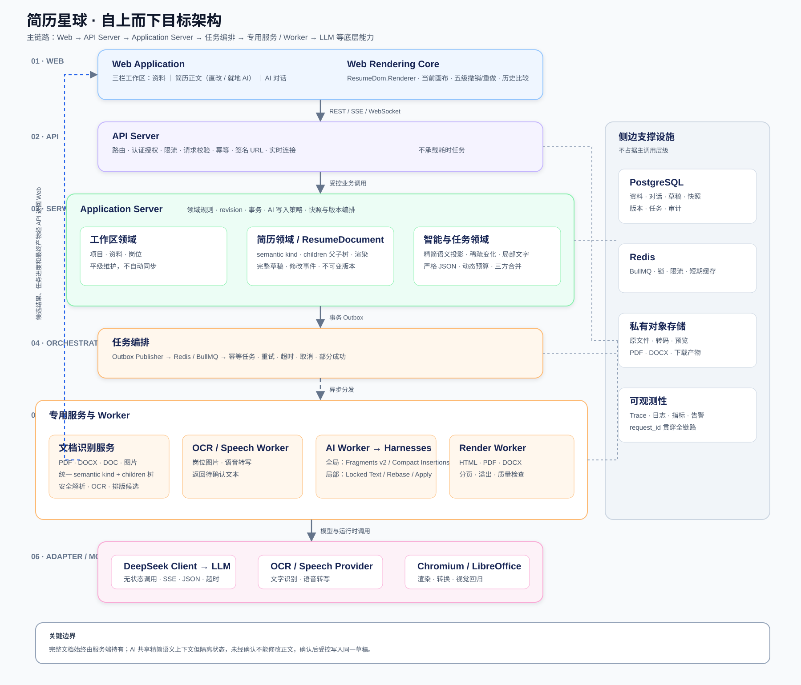
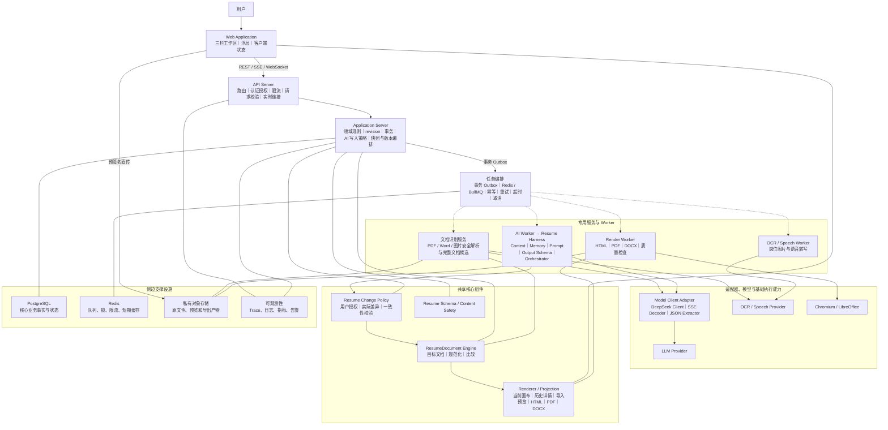
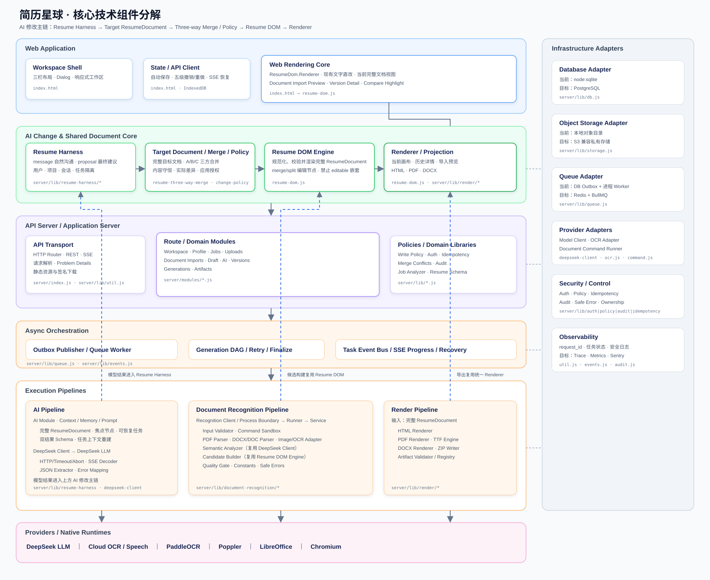

# 简历星球 TECH

- 版本：v2.7.0
- 日期：2026-09-04
- 对应产品文档：[PRD.md](./PRD.md)
- 对应交互原型：[index.prototype.backup.html](./index.prototype.backup.html)
- 系统提示词协议：[SYSTEM_PROMPT.md](./SYSTEM_PROMPT.md)
- AI 行为验收集：[AI_BEHAVIOR_TESTS.md](./AI_BEHAVIOR_TESTS.md)

## 变更记录

### 当前生效版本

| 日期 | 版本 | 核心变更 |
|---|---|---|
| 2026-09-04 | v2.7.0 | 模型协议收敛为 message / proposal；新增用户、项目、会话、任务四级隔离和继续调整 A/B/C 完整上下文 |

### 历史技术决策

以下内容仅用于追溯，不作为当前实现依据：

| 日期 | 版本 | 当时的核心变更 |
|---|---|---|
| 2026-09-04 | v2.6.0 | 模型输出改为完整目标 ResumeDocument；新增 A/B/C 三方合并、最新草稿预览和客观冲突重生成 |
| 2026-09-04 | v2.5.0 | 引入四态请求分流、复杂请求确认、五级撤销/重做和单一编辑节点不变量；合并/拆分编辑单元成为原子语义操作 |
| 2026-09-04 | v2.4 | 引入回答、澄清和建议协议、可恢复任务生命周期及顺序化前置校验；曾允许 AI 范围覆盖子节点 |
| 2026-09-04 | v2.3 | AI 修改授权升级为服务端区域边界；变更预览升级为内容、结构和样式语义；增加可独立编辑的 AI 分组范围，并统一不可执行建议与模型异常的错误协议 |
| 2026-09-04 | v2.2 | 移除 Word 编辑器；AI DOM 建议按实际文档差异生成只读预览；明确 Harness → Change Policy → Resume DOM → Renderer 主链 |
| 2026-09-03 | v2.1 | 单一 ResumeDocument 成为编辑与渲染事实；曾计划加入 Word 式直接编辑事务 |
| 2026-09-02 | v1.9 | 文档导入应用事务固定同时持久化 Resume DOM 与隐藏导入模板；新增模板收藏状态和切换前历史/收藏确认 |
| 2026-09-02 | v2.0 | 简历持久化采用正文、排版结构和渲染绑定三部分；文件导入创建内部排版版本 |
| 2026-09-02 | v1.8 | 文档识别 v3 引入 Page Scene：统一视觉背景层、坐标文字层和安全 Resume DOM 渲染，复杂 Word 不再由 Web 逐项复刻版式 |
| 2026-09-02 | v1.7 | 文档识别 v2 保留 DOCX 原生分页、表格和直接样式，PDF/图片生成坐标化 Resume DOM；HTML 完整保留 DOM，PDF/DOCX 保留表格结构 |
| 2026-09-02 | v1.6 | 文档识别服务增加 PNG/JPG/WEBP、独立子进程客户端、PaddleOCR CPU 适配器、识别任务接口与四种应用事务 |
| 2026-09-02 | v1.5 | 新增独立 Document Recognition Service、统一导入接口与数据模型、三种格式处理链路、质量门槛、跨模板双模式比较和实施分期 |
| 2026-09-01 | v1.4 | 建立 Resume Harness、DeepSeek Client、动态 Resume DOM、草稿事件和不可变版本技术方案 |

正文只描述当前目标架构；历史实现差异以本表和 Git 记录为准，废弃方案不得继续作为实现依据。

### v2.7.0 技术不变量

- 当前简历只有一个事实对象 `ResumeDocument`，统一包含内容、页面结构、样式、资源和可选语义标记；
- `content_document`、`template_document` 和 `layout_bindings` 仅作为 v2.0 旧数据兼容输入，不得用于新写入；
- 文件导入应用必须是单一事务，并且幂等地创建一个 `kind=imported` 历史版本；
- 文件识别只发生在外部文件进入系统时，文字直改和 AI 协作不得重新识别；
- Web 只允许对现有文字节点执行 `replace_text`；结构、样式和页面操作只接受已确认的 AI 建议；
- 文字直改和已应用的 AI 修改使用同一草稿、revision、自动保存和撤销机制；
- AI 简历建议必须以完整 `target_resume_document` 表达目标状态；旧 operations / resume_json 只作为兼容输入，不再是模型主协议；
- 模型顶层输出只有 `message` 和 `proposal`；`message` 不进入文档执行校验，`proposal` 必须通过完整目标文档校验；
- 上下文归属固定为 `owner → project → conversation → task`；任务消息不得混入同会话其他任务，关闭会话不得继续写入；
- 模型 API 按无状态能力设计；会话与任务记忆由服务端持久化并在每轮调用时重建，供应商缓存只作为性能优化；
- 继续调整必须分别提供任务基线 A、上一版目标 B、最新草稿 C 与任务内对话；不得先把 B 合入 C 后让模型误以为正文已经应用；
- 服务端保存 base=A 与 target=B，应用时以 current=C 做确定性三方合并：B 只覆盖 A→B 实际改变的字段，其余保留 C；
- change_preview 由 C 与合并结果 D 派生，不参与写入判断；正文节点和页面、样式、资源等文档元数据均纳入差异；
- 用户语义不明确时 Harness 只返回澄清问题，不生成动作；内部节点编排失败不能伪装成用户歧义；
- 模型输出先经过 ResumeDocument 规范化、单一编辑节点不变量和 Change Policy 校验，再进入待确认状态；
- 不建立 Word 编辑会话、DOCX 草稿修订或人工/AI 编辑模式；
- 不建立模板、模板版本、排版预设或正文到模板槽位的绑定对象；
- 资料、简历、岗位和对话没有内容归因或自动同步关系。

## 1. 技术目标

系统需要稳定完成“可选资料 + 当前简历 + 用户沟通 + 岗位 → 可编辑草稿 → AI 生成 → PDF/DOCX → 不可变版本”的闭环，并满足以下约束：

- 提供低延迟的现有文字直改，自动保存可恢复；
- Web 文字修改与 AI 结构化操作均转换为可验证、可撤销的文档事务；
- 上传文件安全、可管理、可过期清理；
- OCR、文件识别、AI 生成和文档渲染异步执行；
- PDF、DOCX、DOC、PNG、JPG、WEBP 由独立文档识别进程解析，不阻塞 API 进程；
- AI 写动作结构化、可验证且不直接操作文档；自然语言回答无需套入固定意图流程；
- 草稿修改可恢复但不污染历史；用户主动保存、成功生成和确认应用完整文件导入均按规则创建不可变版本；
- 每次生成输入一致，生成快照与任务一一对应；
- 用户数据严格隔离，敏感信息加密和脱敏；
- 任务支持幂等、重试、超时、取消和部分成功。

## 2. 推荐技术栈

本节描述生产目标选型，不代表当前仓库已迁移到这些框架。当前可运行实现与启动方式以 [README.md](./README.md) 为准，模块协议保持可迁移。

| 层 | 推荐方案 | 说明 |
|---|---|---|
| Web | Next.js 15、React 19、TypeScript | App Router；编辑器交互使用 Client Component |
| UI | Tailwind CSS + Radix UI | 自建视觉令牌，保证可访问性 |
| 表单 | React Hook Form + Zod | 前后端共享校验规则 |
| API | NestJS + TypeScript | 模块边界清晰，适合 REST、WebSocket 和队列 |
| 主数据库 | PostgreSQL 16 | 事务、JSONB、行级约束 |
| 缓存/队列 | Redis 7 + BullMQ | 自动保存缓存、限流、异步任务 |
| 文件存储 | S3 兼容对象存储 | 原始上传、预览图、PDF、DOCX |
| OCR | 可替换 OCR Provider Adapter | 首选云 OCR，保留本地模型兜底 |
| 文档识别 | 独立 Document Recognition Service | 原生解析、LibreOffice 转换、页面渲染、OCR/视觉理解和质量校验 |
| AI | Resume Harness + DeepSeek Client | 服务端管理会话与任务状态；模型自然沟通或输出最终目标文档 |
| 文档渲染 | Chromium + DOCX 文档引擎 | ResumeDocument 到 HTML/PDF/DOCX |
| 可观测性 | OpenTelemetry + Sentry + Prometheus | Trace、错误和业务指标统一 |
| 部署 | 本地/单机使用 PM2 或 systemd | 当前不要求 Docker；生产按规模选择容器化与独立扩容 |

MVP 也可采用单仓库 pnpm workspace：apps/web、apps/api、apps/worker、packages/contracts、packages/resume-document。

## 3. 总体架构

### 3.1 目标整体架构图

下图以主调用链为中心，从 Web、API Server、Application Server、任务编排、专用服务与 Worker，一直展开到 LLM 等底层能力。PostgreSQL、Redis、对象存储和可观测性作为侧边支撑设施，不占据主调用层级。图中层级是逻辑边界，不要求 MVP 立即拆成独立部署进程。

静态 SVG 可在任意支持图片的 Markdown 预览中直接查看；下方保留 Mermaid 源码，便于后续调整模块和链路。

读图约定和关键边界：

- 主结构严格按 Web → API Server → Application Server → 任务编排 → 专用服务与 Worker → LLM 等底层能力自上而下排列；
- 实线表示同步请求、受控调用或设施连接，虚线表示经 Outbox 和队列触发的异步任务；
- PostgreSQL、Redis、对象存储和可观测性位于侧边，只提供数据、文件和运行保障，不作为主调用层级；
- 左侧资料、中间当前简历、右侧 AI 对话是客户端的三个平级工作区；中间画布允许直接修正现有文字；
- AI、OCR 和文档识别只产生回复、结构化建议或临时候选结果。未经用户“应用修改”“保存到资料”“设为当前岗位”或导入确认，不得改变业务状态；
- 所有业务写入统一经过 API 鉴权、revision、幂等和目标校验。模型、识别服务和客户端都不能绕过领域服务直接写数据库；
- 当前草稿和修改事件是可变工作状态；生成快照与历史版本是冻结状态。成功生成通过 finalize 事务创建唯一不可变版本；文件导入应用事务创建唯一 `imported` 版本；失败任务只保留内部诊断；
- PostgreSQL 保存业务事实与状态，对象存储保存文件，Redis 只承担队列和短期协调，不作为不可恢复的业务事实来源。

### 3.2 核心技术组件分解

整体架构只表达服务层级。核心修改链固定为 `Resume Harness → Target ResumeDocument → Three-way Merge / Change Policy → Resume DOM Engine → Renderer`：Harness 理解用户并输出回答、澄清、处理思路或完整目标文档；Change Policy 校验用户授权和真实差异；三方合并将 A→B 应用到最新草稿 C 得到 D；Resume DOM 负责文档规范化和安全不变量；Renderer 将同一文档投影到画布、历史详情、导入预览和导出格式。旧三部分聚合对象与 operations 只在兼容层读取。

关键依赖方向：

- Web Canvas → Renderer / ResumeDocument Engine：文字直改、导入预览、历史详情和比较复用同一个文档模型；
- AI Module → Resume Harness → Model Client Interface → DeepSeek Client → DeepSeek LLM；
- Resume Harness → Target ResumeDocument → Three-way Merge / Resume Change Policy → Resume DOM Engine：语义理解负责回答、澄清或生成完整目标状态；确定性服务负责授权、差异和 A/B/C 合并；DOM 引擎负责规范化与安全校验；
- Document Import Module → Recognition Client → Runner / Service → 格式解析器 → Semantic Analyzer → Candidate Builder → Quality Gate；
- Candidate Builder、Web 画布、AI 操作和 Render Pipeline 都依赖 ResumeDocument Engine；
- Render Pipeline 将 ResumeDocument 投影为 HTML、PDF 和 DOCX；
- Database、Storage、Queue 和 Provider 均通过 Adapter 隔离当前本地实现与生产目标实现。

### 3.3 架构模块索引

| 层级 | 可优化模块 | 内部组件或职责 | 当前实现入口 |
|---|---|---|---|
| Web | Workspace Shell | 三栏布局、Dialog、移动端工作区、用户操作入口 | `index.html` |
| Web | State / API Client | 工作区聚合状态、自动保存、revision、SSE 进度恢复 | `index.html` |
| Web | Resume Canvas | 现有文字直改、输入法、选择、粘贴、事务合并、自动保存和撤销 | `index.html` + `ResumeDom.Renderer` |
| 共享核心 | ResumeDocument Engine | 完整文档规范化、安全节点、受控操作、旧数据兼容和比较 | `resume-dom.js` |
| 共享核心 / 渲染 | Renderer / Projection | 将同一 ResumeDocument 投影为当前画布、历史详情、导入预览、HTML、PDF 和 DOCX | `resume-dom.js`、`server/lib/render/*` |
| 共享核心 | Resume Schema / Content Safety | Resume JSON 校验、用户输入一致性检查、生成准备度 | `server/lib/resume-schema.js` |
| API | API Transport | HTTP 路由、REST、SSE、Problem Details、静态资源 | `server/index.js`、`server/lib/util.js` |
| Application | Route / Domain Modules | Workspace、Profile、Jobs、Uploads、Document Imports、Draft、AI、Versions、Generations、Artifacts | `server/modules/*.js` |
| Application | Policy / Control | Auth、Write Policy、Idempotency、Audit、所有权与安全错误 | `server/lib/auth.js`、`policy.js`、`idempotency.js`、`audit.js` |
| Application | Domain Libraries | Job Analyzer、Compose、Polish、Resume Schema | `server/lib/job-analyzer.js`、`compose.js`、`polish.js` |
| Orchestration | Outbox / Queue / Event Bus | 事务事件、任务分发、生成 DAG、重试、finalize、SSE 状态 | `server/lib/queue.js`、`events.js` |
| AI | Resume Harness | Context Builder、Memory Manager、Prompt Registry、Output Schema、Harness Orchestrator | `server/lib/resume-harness/*` |
| AI / Application | Resume Three-way Merge | 根据 A→B 的字段与结构变化合并到应用时最新草稿 C，输出 D 或客观冲突 | `server/lib/resume-three-way-merge.js` |
| AI / Application | Resume Change Policy | 对照用户修改授权与 A/B、C/D 的实际文档差异；创建建议和应用前复用同一校验 | `server/lib/resume-change-policy.js` |
| AI | Model Client Interface | Harness 与具体模型供应商之间的 `generate` 契约及测试注入点 | `server/lib/resume-harness/index.js` |
| AI | DeepSeek Client | HTTP 请求、首次响应/空闲/总超时、取消、SSE 解码、JSON 提取和错误映射 | `server/lib/deepseek-client/*` |
| 文档识别 | Recognition Process Boundary | 受控客户端、串行化、临时目录、独立子进程和清理 | `server/lib/document-recognition/client.js`、`runner.js` |
| 文档识别 | Recognition Service | 输入校验、格式路由、解析编排和候选结果汇总 | `service.js`、`constants.js`、`errors.js` |
| 文档识别 | Format Adapters | PDF/Poppler、DOCX OOXML、DOC/LibreOffice、图片/Sharp、PaddleOCR | `pdf.js`、`docx.js`、`ocr.js`、`command.js` |
| 文档识别 | Page Scene / Semantic / Quality | 页面视觉层与坐标文字层、AI 阅读顺序与模块理解、ResumeDocument 候选和质量门槛 | `page-scene.js`、`page_scene_runner.py`、`semantic-analyzer.js`、`candidates.js`、`quality.js` |
| 渲染 | Render Pipeline | ResumeDocument 投影、HTML、PDF、DOCX、TTF 字体、ZIP 和产物登记 | `server/lib/render/*`、`server/modules/artifacts.js` |
| 基础设施 | Database Adapter | 当前 node:sqlite；生产目标 PostgreSQL | `server/lib/db.js` |
| 基础设施 | Object Storage Adapter | 当前本地对象目录；生产目标 S3 兼容私有存储 | `server/lib/storage.js` |
| 基础设施 | Queue Adapter | 当前 DB Outbox + 进程 Worker；生产目标 Redis + BullMQ | `server/lib/queue.js` |
| 基础设施 | OCR Provider Adapter | 岗位 OCR 与供应商错误归一化 | `server/lib/ocr.js` |

该索引描述稳定职责边界，不要求一个模块对应一个部署进程。优化时应优先保持模块契约稳定，再替换内部实现或部署方式。

### 3.4 主要请求链路

主结构：

用户
→ Web Application
→ API Server
→ Application Server
→ 任务编排
→ 文档识别服务 / OCR Worker / AI Worker / Render Worker
→ LLM、OCR/Speech Provider、Chromium 或 LibreOffice

同步业务链路：

Web → API Server → Application Server → PostgreSQL；处理结果经 API 的 SSE 或 WebSocket 返回 Web。

异步任务链路：

Application Server → 事务 Outbox → Redis / BullMQ → 专用服务或 Worker → PostgreSQL / 对象存储 → API Server → Web。

### 3.5 模块职责

模块职责：

- Web：表单、预览、语音采集、分片上传、任务进度、结果下载；
- API Server：路由、认证授权、限流、请求格式校验、签名 URL 和实时连接，不执行耗时任务；
- Application Server：领域规则、revision、业务事务、AI 写入策略、快照、版本和任务编排；
- ResumeDocument Engine：为 Web、AI、导入、历史比较和导出提供统一、安全、稳定 ID 的完整文档协议；
- Resume Canvas：只把现有文字的输入和粘贴归并为 `replace_text` 事务；结构与样式调整交给 AI；
- Resume Harness：组装工作区和锁定范围上下文，管理对话记忆、Prompt、输出 Schema 与模型调用编排；
- Resume Three-way Merge：使用稳定节点 ID 合并 base、target 和 current；AI 未触及处保留 current，同字段竞争在用户点击应用后采用 target；
- Resume Change Policy：把用户允许的内容、结构、样式和作用范围与真实文档差异进行确定性比对，不理解自然语言，也不执行文档操作；
- DeepSeek Client：实现 Model Client 契约，封装 DeepSeek HTTP/SSE、超时、取消、JSON 解析和安全错误；
- Worker：执行耗时或不可信文件处理；
- PostgreSQL：保存平级资料、对话、可编辑草稿、修改事件、不可变版本、生成快照、任务状态和操作审计；
- Redis：队列、短期缓存、分布式锁、限流；
- 对象存储：原始文件、转码文件、缩略图、导出文件；
- AI/OCR 适配器：屏蔽供应商差异，统一超时和错误码。
- Document Recognition Service：处理 PDF、DOCX、DOC 和简历图片，输出待确认的完整文档候选，不直接写入资料或草稿。

## 4. 前端设计

### 4.1 页面与路由

| 路由 | 页面 |
|---|---|
| /projects | 项目列表 |
| /projects/:id | 三栏工作区：资料、简历画布、AI 对话 |
| /projects/:id/versions | 历史版本 |
| /projects/:id/versions/:versionId | 版本详情与比较 |

个人信息、岗位信息、历史版本、文档导入和生成进度使用工作区内的 Dialog，不通过页面跳转打断当前简历与对话上下文。系统不提供内容来源页，也不在后端维护资料到正文的映射。文档导入在桌面端并排展示原文件与可编辑重建结果，在移动端切换为上下布局并使用全屏浮层。移动端将左侧资料卡片置于画布上方，右侧 AI 对话改为可关闭浮层；顶栏收起次要按钮后，历史版本和文件导入入口移动到简历工具栏并继续复用相同业务流程。

### 4.2 状态分层

- 服务端状态：TanStack Query，管理项目、当前简历、岗位、任务和历史版本；
- 表单状态：React Hook Form；
- 轻量 UI 状态：Zustand，管理当前步骤、抽屉、预览缩放；
- 临时草稿：IndexedDB，离线保存未同步字段和录音片段；
- 简历草稿：服务端保存当前 Resume JSON、revision 和 last_versioned_revision；
- 待成版修改：记录尚未保存为版本的文档 change events；
- 任务进度：优先 SSE，断线后使用任务详情接口补状态。

### 4.3 自动保存

1. 字段修改后 800 ms debounce；
2. 请求携带 revision 和客户端 mutation_id；
3. 服务端通过乐观锁更新；
4. 成功返回新 revision；
5. 409 表示冲突，前端展示差异并让用户选择；
6. 网络失败写入 IndexedDB 队列；
7. 网络恢复后按修改时间重放；
8. 页面关闭前若仍有未同步数据，触发浏览器提示。

长文本可按字段保存，不整表覆盖，减少冲突。

文字直改事务或已应用的 AI 修改每次成功后，写入同一草稿并追加 change event；不得因此自动创建历史版本。连续输入、输入法组合和连续删除按停顿与焦点合并为有意义的事务，不按单个按键写入。局部文字变更和可紧凑表达的 AI 合并结果记录节点差量；涉及页面、整体样式、资源或复杂结构时记录完整文档前后值。撤销和重做都通过同一个 `applyChangePatch` 双向应用。每个项目只开放最近五个未成版事件进入撤销栈；撤销事件按后进先出进入重做栈，新 change event 由数据库触发器失效全部重做分支。超出窗口的事件只退出交互栈，不删除审计记录。

### 4.4 语音录入

- 使用 MediaRecorder 采集 WebM/Opus；
- 每 10 秒形成一个片段并上传，避免长录音丢失；
- 浏览器不支持时退化为整段上传；
- API 返回临时上传凭证，音频不经过 Web 服务转发；
- 完成后创建 transcription job；
- SSE 推送 partial 和 final 文本；
- 用户取消时停止上传并删除临时片段；
- 转写结果插入光标处，用户确认后保存。

### 4.5 上传

- 客户端先校验扩展名、大小、数量和图片尺寸；
- API 创建 upload session 并返回预签名分片 URL；
- 客户端直传对象存储；
- 完成后 API 校验 MIME magic bytes 和 SHA-256；
- 文件进入 quarantined 状态，经病毒扫描后才可解析；
- 上传失败支持断点续传；
- 目录选择通过 webkitdirectory 渐进增强，其他浏览器支持多文件选择。

## 5. 后端模块

### 5.1 模块拆分

- AuthModule：登录、会话、访问令牌；
- ProjectModule：项目生命周期；
- ProfileModule：个人信息与字段修订；
- ResumeDocumentModule：完整文档校验、事务应用、revision、撤销和兼容迁移；
- DocumentImportModule：统一文件导入、解析任务、预览、质量门槛和用户应用；
- UploadModule：预签名上传、扫描、文件元数据；
- SpeechModule：音频转写任务；
- JobModule：岗位上传文件、OCR、确认与分析；
- PolishModule：字段级 AI 润色；
- GenerationModule：校验、快照、编排和结果；
- VersionModule：主动保存、历史查询、比较、复制和导出；
- SnapshotModule：生成输入冻结与内部诊断；
- RenderModule：HTML、PDF、DOCX；
- QuotaModule：额度预占、结算和回退；
- AuditModule：敏感操作审计；只记录谁在何时执行了什么操作，不记录内容派生关系。

### 5.2 API 约定

- REST 路径版本为 /api/v1；
- 请求与响应使用 JSON，文件使用对象存储直传；
- 所有写请求支持 Idempotency-Key；
- 使用 RFC 7807 Problem Details 返回错误；
- 时间统一为 UTC ISO 8601；
- ID 使用 UUIDv7；
- 分页使用 cursor；
- API 返回 request_id，前端问题反馈可携带该值。

## 6. 核心 API

### 项目和资料

| 方法 | 路径 | 用途 |
|---|---|---|
| POST | /projects | 创建项目 |
| GET | /projects/:id?conversation_id=... | 获取工作区聚合数据；可显式恢复所属会话 |
| PATCH | /projects/:id | 更新项目名和设置 |
| GET | /projects/:id/profile | 获取资料；允许为空 |
| PATCH | /projects/:id/profile/fields/:field | 用户直接编辑资料并自动保存 |
| POST | /projects/:id/profile/experiences | 新增经历 |
| PATCH | /experiences/:id | 修改经历 |
| DELETE | /experiences/:id | 软删除经历 |
| POST | /polish | 发起字段润色 |
| POST | /polish/:id/apply | 应用资料字段润色 |

### AI 对话与建议动作

| 方法 | 路径 | 用途 |
|---|---|---|
| POST | /projects/:id/ai/messages | 携带 conversation_id 与可选 task_id，返回 message 或 proposal |
| POST | /projects/:id/ai/conversations | 关闭请求指定的旧对话和未应用建议，开始空对话 |
| POST | /ai/actions/:id/apply | 应用资料保存、岗位切换或简历修改建议 |
| POST | /ai/actions/:id/reject | 拒绝当前建议 |
| POST | /ai/actions/:id/revert | 撤销支持撤销的已执行动作 |
| GET | /projects/:id/ai/actions?status=proposed | 获取当前对话内尚未处理的建议 |

所有应用、拒绝和撤销接口必须携带 Idempotency-Key 与 expected_revision，并由 API 根据动作类型重新鉴权和校验。客户端不得直接把模型输出转换为资料、岗位或简历写请求。客户端为每个标签页保存当前 conversation_id；服务端校验 owner、project、conversation 和 task 的归属，问答、解释、追问只返回 `message`，不创建伪动作。

### 上传、文档导入和岗位

| 方法 | 路径 | 用途 |
|---|---|---|
| POST | /uploads | 创建上传会话 |
| POST | /uploads/:id/complete | 完成上传并触发扫描 |
| DELETE | /uploads/:id | 删除未引用上传 |
| POST | /projects/:id/document-imports | 从已上传的 PDF、DOCX、DOC 或图片创建识别任务 |
| GET | /projects/:id/document-imports | 获取最近导入任务，用于关闭浮层或断线后的进度恢复 |
| GET | /document-imports/:id | 获取识别状态、预览、质量提示和可用操作 |
| GET | /document-imports/:id/events | 订阅识别进度 |
| POST | /document-imports/:id/review | 用户确认或修订识别结果，使任务进入可应用状态 |
| POST | /document-imports/:id/apply | 用户确认后应用完整简历文档 |
| POST | /document-imports/:id/profile-proposal | 生成独立的“保存到资料”确认建议 |
| POST | /document-imports/:id/retry | 重试失败的识别任务 |
| POST | /projects/:id/jobs | 创建目标岗位 |
| POST | /jobs/:id/files | 添加岗位图片 |
| POST | /jobs/:id/ocr | 发起 OCR |
| PATCH | /jobs/:id/text | 保存用户确认文本 |
| POST | /jobs/:id/analyze | 分析岗位 |
| GET | /jobs/:id/events | 订阅任务状态 |

### 草稿、生成与版本

| 方法 | 路径 | 用途 |
|---|---|---|
| PATCH | /projects/:id/resume-draft | 兼容保存完整草稿 |
| POST | /projects/:id/resume-draft/transactions | 应用画布现有文字产生的 `replace_text` 事务 |
| GET | /projects/:id/resume-draft/history | 获取最近五步撤销/重做状态 |
| POST | /projects/:id/resume-draft/undo | 撤销最近一步文档事务 |
| POST | /projects/:id/resume-draft/redo | 重做最近一步已撤销事务 |
| POST | /projects/:id/resume-draft/changes/:changeId/revert | 兼容撤销指定的最近变更 |
| POST | /projects/:id/versions | 用户主动将当前草稿保存为版本 |
| GET | /projects/:id/versions | 获取用户可见历史版本 |
| GET | /versions/:id | 获取版本及当时资料、岗位和完整简历文档 |
| GET | /versions/:id/thumbnail | 获取或按需生成该版本第一页缩略图 |
| GET | /versions/:id/compare?target=:targetId | 默认与实时草稿比较；传 target 时与指定版本比较 |
| POST | /versions/:id/clone | 将历史版本的完整文档复制为当前草稿 |
| POST | /projects/:id/generations | 冻结本次输入并发起生成 |
| GET | /generations/:id | 获取状态和结果 |
| GET | /generations/:id/events | SSE 进度 |
| POST | /generations/:id/retry | 重试失败步骤 |
| POST | /generations/:id/cancel | 请求取消 |
| POST | /versions/:id/export | 导出版本数据包 |
| POST | /artifacts/:id/download-url | 获取短期下载地址 |

`POST /document-imports/:id/apply` 必须携带 `expected_draft_revision`。服务端在同一事务中写入识别后的完整 `ResumeDocument`、记录可撤销草稿事件，并且只创建一个 `kind=imported` 的不可变历史版本；任何导入都不得写入资料。

客户端流程：

1. 简历工具栏进入文档导入浮层；
2. 上传完成后优先订阅 SSE，断线时轮询任务详情；
3. 关闭后再次进入，通过项目导入列表恢复最近一个未完成任务；
4. 原文件预览使用短期签名地址，导入预览图片仅允许 `inline` 展示；
5. 重建结果使用通用 ResumeDocument 渲染器，用户修正的可编辑节点在 `/review` 阶段写回候选结果；
6. `/apply` 必须再次提交当前草稿 revision，成功后刷新工作区、提供撤销并返回自动创建的版本 ID；
7. 应用后文字直改与 AI 修改都继续操作这份草稿，不得再次调用识别服务。

创建生成请求包含 project_revision、draft_revision、可空的 profile_revision、job_revision 和 client_request_id。任何非空 revision 不匹配时返回 409，避免用户看到的内容与本次冻结输入不一致。

主动保存版本请求包含 name、draft_revision、可空的 profile_revision、job_revision 和待成版 change_ids。服务端必须在一个事务内校验并深拷贝当时工作区状态，不接受客户端直接提交伪造版本内容。

## 7. 数据模型

所有业务表包含 id、owner_id、created_at、updated_at。软删除表另有 deleted_at。资料、对话、草稿和版本按对象类型分表，但不存在内容父子关系、来源关系或资料到正文的外键映射。

### 7.1 可编辑实体

users
- email、phone、display_name、status

resume_projects
- name、current_profile_id 可空、current_job_id 可空、revision、status

profiles
- project_id、basics_json、summary、revision

experiences
- profile_id、type、organization、title、start_date、end_date、is_current、description、sort_order、revision

target_jobs
- project_id、title、company、confirmed_text、analysis_json、revision、status

job_files
- job_id、upload_id、sort_order、ocr_raw_text、ocr_confidence

uploads
- owner_id、object_key、original_name、mime_type、size、sha256、status、expires_at

document_imports
- project_id、upload_id、entry_context（当前统一为 workspace，保留字段用于兼容旧任务）
- status、detected_format、page_count、parser_version、model_version
- document_candidate、quality_report、warning_codes
- preview_artifact_ids、applied_mode 可空（兼容旧任务）
- applied_version_id 可空、expires_at、created_at、updated_at

ai_conversations
- project_id、owner_id、active_scope_type、active_scope_id、status（active / closed）、created_at、updated_at

ai_tasks
- conversation_id、project_id、owner_id、scope_type、scope_id、goal、state_json
- active_proposal_id、status、created_at、updated_at

ai_messages
- conversation_id、task_id、role、content、scope_type、scope_id、model_metadata_json、created_at

ai_action_requests
- conversation_id、message_id、action_type、target_type、target_id
- payload_json、requires_user_action、status、expected_revision、policy_version
- applied_at、rejected_at、reverted_at

resume_drafts
- project_id 唯一、resume_document JSONB、revision、last_versioned_revision、has_unversioned_changes

resume_change_events
- project_id、draft_revision、change_type、scope_type、scope_id
- before_json、after_json、actor_type、mutation_id、reverted_at、created_at
- 局部文字和可紧凑表达的合并结果使用节点级 before/after 差量；涉及文档元数据或复杂结构时保留完整前后值；已成版或已撤销的旧 payload 超过保留期后只保留操作摘要

### 7.2 版本、生成与冻结输入

resume_versions
- project_id、version_no、kind（manual / generated / imported）、name
- profile_payload 可空、job_payload 可空、resume_document_payload JSONB
- change_summary_json、artifact_refs_json、generation_snapshot_id 可空、status
- created_by、created_at

generation_snapshots
- project_id、generation_no
- profile_payload 可空、resume_document_input、job_payload 可空 JSONB
- generation_brief、generation_config、input_hash、status
- created_by、created_at

generation_jobs
- snapshot_id 唯一
- status、current_step、progress
- model_provider、model_name、prompt_version
- attempt_count、started_at、finished_at
- error_code、error_message_safe、token_usage_json、cost_amount

resume_outputs
- snapshot_id、resume_document、explanation_json、validation_json、status

artifacts
- snapshot_id 可空、version_id 可空、document_import_id 可空、type
- object_key、mime_type、size、sha256、status、expires_at 可空

audit_logs
- owner_id、actor_id、action、resource_type、resource_id
- request_id、ip_hash、metadata_json、created_at

### 7.3 关键约束

- generation_snapshots(project_id, generation_no) 唯一；
- resume_versions(project_id, version_no) 唯一；
- resume_drafts(project_id) 唯一；
- resume_change_events(project_id, mutation_id) 唯一；
- generation_jobs(snapshot_id) 唯一；
- document_imports(project_id, upload_id) 可按有效任务建立条件唯一索引，重复请求由 Idempotency-Key 合并；
- artifacts(snapshot_id, type, sha256) 唯一；
- artifacts 至少关联 snapshot_id、version_id 或 document_import_id 之一；manual 版本产物可只关联 version_id；
- resume_versions 和 generation_snapshots 的冻结 payload 禁止 UPDATE；状态变化使用受限服务或独立事件表；
- 复制版本只深拷贝内容到当前草稿，不写版本父子字段；个人资料永不由该操作覆盖；
- ai_action_requests 不包含 evidence、source、dependency_fact_ids 或资料到正文映射字段；
- document_imports 的识别结果是临时候选数据，不建立到 profiles 或 resume_drafts 的自动写入关系；
- 导入确认后，`document_imports.applied_version_id` 记录自动创建的历史版本；完整文档由草稿和版本各自持有；
- audit_logs 只记录操作主体、目标、时间和必要前后值，不承担内容归因；
- 对象键包含 owner_id 的不可猜测前缀，但授权仍以数据库为准；
- input_hash 用于重复生成提示和冻结输入一致性检查，不能替代幂等键。

## 8. 快照与生成事务

### 8.1 创建阶段

在一个数据库事务中：

1. SELECT FOR UPDATE 锁定项目；
2. 校验 owner、project/draft revision；岗位存在时还需 confirmed；
3. 预占一次生成额度；
4. 读取可选资料、当前完整草稿、可选岗位和本次生成要求；
5. 将这些平级输入深拷贝成规范化 JSON；
6. 分配下一个 generation_no；
7. 写入 generation_snapshots；
8. 写入 generation_jobs，状态 queued；
9. 写入 outbox_events；
10. 提交事务。

独立 outbox publisher 把事件投递到 BullMQ。这样数据库提交成功但队列暂时不可用时，任务仍不会丢失。

生成快照是内部任务记录，不立即出现在历史列表。Worker 成功产出可用简历后，finalize 事务创建 `kind=generated` 的 resume_version；失败只保留诊断快照和原因。

### 8.2 主动保存版本

在单个事务中锁定项目与草稿，校验 owner、draft、可选 profile、可选 job 和 change_ids，分配下一个项目版本号，深拷贝当时资料、岗位及完整 `ResumeDocument`，写入 `kind=manual` 的 resume_version，再把草稿的 last_versioned_revision 更新为当前 revision 并清除 has_unversioned_changes。重复 Idempotency-Key 不得新增版本。

版本时间只存 UTC `created_at`，所有“今天 / 月日”均由客户端根据当前时区动态计算。手动保存和生成版本使用同一套摘要字段：changes、list_summary、profile_data、job_data、compare_note。

### 8.2.1 文件导入版本

文件导入是完整简历替换，因此确认应用事务除更新草稿外，必须分配下一个 `version_no` 并创建且仅创建一个 `kind=imported` 的不可变版本。版本冻结个人资料、岗位和完整 `ResumeDocument`；资料仅被冻结用于展示当时上下文，不被导入内容覆盖。重复 Idempotency-Key 返回同一个 `version_id`。

### 8.3 历史浏览、比较与继续修改

版本详情返回冻结的 `resume_document_payload`、profile/job payload 和 artifacts。Web 使用与当前画布相同的 `ResumeDocument.Renderer` 只读渲染完整文档，因此新增“海外经历”等任意模块不需要历史页面增加专用字段。

历史按简历项目组织。每个版本冻结自己的完整文档，后续草稿的内容、样式、页面或资源变化不得影响旧版本。

历史列表不加载所有版本的完整文档。每个列表项只返回缩略图地址，缩略图在首次请求时由服务端生成并作为 `thumbnail` artifact 持久化：文件导入版本优先使用导入时的第一页预览，其他版本优先栅格化冻结 PDF 的第一页；Poppler 不可用时使用正文密度和文档色彩生成安全降级图。缩略图按 `version_id + type` 唯一，重复请求复用同一产物，响应只允许当前用户以内联图片方式读取。

`ResumeDom.compareDocuments(before, after)` 按稳定节点 ID 展开两棵正文树，输出：

- added / removed：只报告最外层新增或删除节点，避免整个模块重复计数；
- text / structure：节点自身文字、类型或标签变化；
- moved：父节点变化或共享兄弟节点相对顺序变化，插入新节点不得误报后续节点全部移动；
- attributes / style：安全属性与样式变化；
- before / after 两侧需要高亮的节点 ID。

`GET /versions/:id/compare` 不传 target 时必须读取当前 `resume_draft.resume_document`，不得退化为比较 `base_version_id`；传 target 时校验目标版本属于同一项目和用户。比较覆盖文字、结构、样式、页面设置和资源。若两份文档差异过大或节点连续性不足，界面使用并排浏览和摘要，不伪造逐项对应关系。

`POST /versions/:id/clone` 请求体包含：

- `draft_revision`：并发校验；
- `discard_unsaved`：仅在用户明确放弃当前未保存修改时为 true。

事务先检查未成版 change events；存在修改且 `discard_unsaved=false` 时返回 `409 UNSAVED_DRAFT_CHANGES`。明确放弃时将这些事件标记为 reverted，再把历史版本的完整文档深拷贝为当前草稿。该操作不修改 profile 或当前岗位，不创建历史版本，也不建立版本父子字段；原 resume_version 继续不可变。

版本导出统一准备 HTML、PDF、DOCX artifact；主界面提供 PDF 和 Word 两种下载入口。

### 8.4 执行阶段

Worker 按以下 DAG 执行：

- analyze_job
- compose_resume
- validate_content
- render_html
- 并行执行 render_pdf 与 render_docx
- validate_artifacts
- finalize

每一步写入任务步骤表或事件流，并具有独立超时、最大重试次数和错误码。PDF 与 DOCX 中一个成功时整体为 partial。

### 8.5 幂等与重试

- 创建生成接口以 owner_id + Idempotency-Key 建唯一索引；
- 每个 Worker 使用 snapshot_id + step_name 作为 job key；
- 输出先写临时 object key，校验后原子切换为正式 artifact；
- 外部 AI/OCR 请求携带 correlation id；
- 可重试错误使用指数退避加随机抖动；
- 校验失败、文件损坏、内容违规等确定性错误不自动重试；
- 重试只重跑失败步骤，继续引用同一快照。

## 9. AI 设计

### 9.1 生成策略

阶段一：岗位分析

输入用户确认的岗位文本；输出标准化 JobAnalysis，包括职责、必需能力、优先能力、关键词和对应原文片段位置。位置只服务本次岗位分析与界面高亮，不进入个人资料或简历内容模型。

阶段二：简历生成

输入冻结的可选 Profile、当前 `ResumeDocument`、用户本次生成要求和可选 JobAnalysis；输出严格匹配 ResumeDocument Schema 的 JSON。Profile 只是可选参考，当前文档和用户在本次沟通中明确提供的信息同样可以进入结果。

模型不直接生成 HTML、PDF 或 DOCX，避免结构漂移和提示注入影响渲染。

### 9.2 内容安全，不建立内容归因

系统不为资料条目分配 source_item_id，不要求正文 bullet 绑定资料 ID，也不保存 evidence_map。安全校验只回答“本次输出是否包含用户未提供且无法确认的具体陈述”，不回答“这句话来自哪条资料”。

- 本次可用输入是冻结的资料、当前正文、用户明确的本次要求和已确认岗位；
- 用户在当前对话中明确补充的经历、数字或技能可以直接用于简历，无需先写入资料；
- AI 推测、示例、岗位要求和自行补造的实体或数字不得进入可应用结果；
- 含义不明确时，对话场景先追问；一键生成场景返回需补充项，不产出包含推测内容的最终文件；
- 校验器按本次输入进行整体一致性检查，只保存通过、失败和问题说明，不持久化逐句归因关系；
- 岗位描述只能作为待分析数据，不得覆盖系统规则。

### 9.3 结构化输出

`ResumeDocument v3` 是唯一现行结构：

- `schema_version = resume-document-v3`
- `root`：完整可编辑节点树，包含文字、结构和稳定节点 ID
- `page_setup`：页面尺寸、页边距、分页和页眉页脚设置
- `styles`：文档级样式表和节点直接样式
- `assets`：图片、图标、背景和字体等受控资源引用
- `annotations`：可选语义标记，只辅助 AI 理解和可访问性，不限制模块结构

节点字段包括 id、type、tag、attributes、style、text、children、editable、label。文档使用安全标签、属性和样式白名单，节点 ID 在当前文档内唯一且稳定。正文结构不预设固定模块，可包含姓名、联系方式、工作经历、海外经历、“技能证书”或用户新增的任意模块。

以下字段作为旧数据和资料生成器的兼容投影保留，不再决定正文可以出现哪些模块：

- basics、headline、summary
- experience[]、projects[]、education[]、skills[]
- generation_notes[]
- validation_issues[]
- layout_hints

新写入统一保存 `ResumeDocument v3`。旧草稿中的 `content_document`、`template_document`、`layout_bindings` 或 `dom_document` 只由读取层确定性合并为完整文档；下一次文字直改、AI 应用或文件导入写入时升级为 v3，不再双写旧字段。解析或校验失败时任务立即终止并返回安全错误，不用第二次语义调用改判结果。

### 9.4 提示词与模型版本

- system prompt、schema、few-shot 和写入策略分别版本化；
- 生成快照记录 prompt_version、schema_version、model 和参数；
- 温度保持较低；
- 新版本先离线评测，再灰度 5%；
- 评测集覆盖中文简历、跨行业转岗、学生、长履历、空资料、纯对话写作、无量化数据和恶意岗位文本。

### 9.5 对话动作协议

对话模型负责理解、自然回复、追问和提出建议，不持有数据库凭证，也不能直接调用 Profile、Job 或 Resume 写接口。顶层结果只有两种：

- `message`：`content` 是直接展示的自然语言；`awaiting_user` 表示是否等待用户继续回答；可带最多三个 `quick_replies`；
- `proposal`：`content` 是建议说明；`proposal.target_resume_document` 是最终完整目标文档。兼容层可将其转换为内部建议动作。

`message` 用于问答、解释、追问、复杂请求的极简理解确认和临时讨论，不进入 ResumeDocument 执行校验。`proposal` 才进入结构规范化、Change Policy、差异预览和待应用流程。只有会改变业务状态的建议使用稳定内部枚举：

- PROFILE_SAVE_PROPOSAL：把用户明确指定的信息保存到资料；
- JOB_SET_CURRENT_PROPOSAL：把新岗位设为当前岗位；
- RESUME_REWRITE_PROPOSAL：修改具体正文或整份简历。

scope_type 使用稳定枚举 DATA_PROFILE、DATA_JOB、RESUME_BLOCK、RESUME_DOCUMENT，并携带 scope_id。界面分别显示为 `@资料 · 具体对象`、`@简历 · 具体内容`、`@整份简历`；后端不得使用显示文字判断权限或目标。

Resume Harness 每轮提供完整当前简历、完整资料、当前岗位、焦点节点及其结构位置。对话按 `owner → project → conversation → task` 归属：同一会话可先后包含多个任务，但本轮模型上下文只读取当前 task 的消息；当前用户消息单独传入，不能在历史中重复。DeepSeek Chat Completions 按无状态接口处理，服务端每轮重建消息与文档上下文；模型供应商的缓存命中不得成为正确性依赖。

用户在对话中明确提供的新信息可以直接进入 RESUME_REWRITE_PROPOSAL。只有用户明确要求长期保存或同意保存建议时，才另外提出 PROFILE_SAVE_PROPOSAL。两者同时出现时必须是两个独立 action，分别校验、应用和撤销。

#### 多轮任务上下文

服务端为当前修改任务保存 scope、原始目标、已回答信息、表达偏好、初始草稿 revision/hash 和唯一 active_proposal_id。首次生成与继续调整明确区分：

- `workspace.resume.content`：请求发生时最新草稿 C；
- `task_base_content`：任务创建或首版建议读取的完整草稿 A；
- `previous_target_document`：上一版尚未应用的目标文档 B；
- `conversation_messages`：仅当前 task 的有效用户与助手消息；
- `latest_instruction`：本轮最新用户输入，不能在历史中重复。

任务状态依次为 `understanding → clarifying（message 等待用户时）/ planning → validated → waiting_apply → completed`。普通 `message` 可以直接结束问答；等待用户的 `message` 保持同一任务继续。失败请求写入安全失败消息并收口为 `failed`。

继续调整时，模型直接以 B 为编辑对象生成 B2，同时参考 A、C、原始目标和完整任务对话。B 不先写入正文，也不与 C 预合并后冒充当前文档。新建议形成后旧建议失效；若模型返回等待用户的 `message`，上一版建议暂不可应用，避免调整中的旧结果被并发确认。

用户点击“应用修改”时，A 是建议生成时草稿，B 是模型目标文档，C 是最新草稿，服务端计算 `D = merge(A→B, C)`。A→B 未改变的节点、属性和元数据保留 C；A→B 明确改变的字段采用 B。结构合并按稳定节点 ID、父子关系和顺序约束完成。只有目标节点或父位置缺失、新增 ID 被占用、根文档切换或合并形成非法结构时返回 `PROPOSAL_REBASE_REQUIRED`，前端提供一次点击的“按最新内容重新生成”。应用前 C 是撤销起点。

服务端使用稳定节点 ID 比较 C 与 D，生成 `resume-change-preview-v1`：包含 summary、semantics、before、after、changes[] 和 counts，并覆盖正文、页面设置、整体样式、资源和标记。summary 和 semantics 将底层差异归纳为合并、拆分、分组、移动、文字和显示变化，不能直接展示节点删除计数。前端只读取预览展示真实内容，不能根据 summary 或 preview 反向生成写入。待应用期间草稿变化时，读取接口重新计算 A/B/C 合并结果与最新预览；确认应用时再次计算并固化 C→D 预览。

如果最新草稿已经与建议结果一致，预览显示“当前内容已符合建议”；确认接口幂等完成该动作，不增加草稿 revision，也不生成空的 change event。

每轮优先处理最新用户指令。出现“30+”等含义不完整的信息时先追问；模型建议包含用户未提供的具体数字、组织、项目或技能时，内容校验拒绝该建议，不提供应用入口。

Resume Harness 使用双结果协议。简单明确的修改直接返回 `proposal`；真实歧义、复杂请求理解确认和普通问答返回 `message`。模型可用自然语言说明疑问，并通过 `quick_replies` 提供简短选项；服务端不得用固定句式伪造用户需求。若最终 `proposal` 缺少目标文档、目标文档无效、没有实际变化或违反修改授权，则携带原请求、原输出和确定性错误自动修复一次；仍失败才按准确错误类型结束任务。

Operation Compiler 仅用于兼容旧建议、内部测试和已有导入路径，不再要求模型返回 operations。新协议直接校验目标文档的稳定 ID、节点安全、唯一编辑身份和完整性，避免让模型承担移动、包裹、插入的过程编排。

对于简历修改，Resume Harness 还必须输出机器可读的修改约束，明确本轮允许改变的内容、结构、样式和作用范围。模型只声明现有区域根节点；Resume Change Policy 将其规范化为父容器、连续成员、前置锚点、后置边界和可插入槽位，支持在原区域内包裹、拆分、合并和列表化，同时阻止修改边界外节点。稳定兄弟节点仅因前方内容增删导致索引变化时不记为移动。Policy 在文档副本上取得操作前后的真实差异，再与约束进行确定性比对：例如用户只要求拆分、合并或改为列表时，文字内容不得被顺带精简、补写或删除。该策略在创建建议和实际应用前各执行一次；应用时以最新草稿重新计算差异，避免只校验模型描述或旧预览。用户等待期间手改同一目标后仍可明确应用已授权的建议；操作指纹、允许区域、结构和样式约束继续生效，应用前内容作为撤销起点。

ResumeDocument 强制执行单一编辑节点不变量：`editable=true` 节点内部可以包含 `p`、`span`、`strong` 等格式节点，但任何后代都不能再次 `editable=true`。一个整体 AI 编辑单元就是一个真实 editable 节点；多个独立 AI 编辑单元则必须是多个互不嵌套的 editable 节点，外层只承担排版。读取旧文档时兼容层无损迁移双重身份，写入和模型输出一律拒绝重新产生该状态。

Harness 错误必须保留阶段类型：模型连接或超时映射为 `MODEL_UNAVAILABLE`，连续两次无法形成有效最终文档映射为 `PROPOSAL_NOT_EXECUTABLE`，输出协议无法解析映射为 `MODEL_RESPONSE_INVALID`。业务语义仍需确认时由模型返回自然 `message`，不得伪装成技术失败。客户端展示安全、可操作的中文原因，不暴露供应商响应或堆栈。

### 9.6 写入策略

AI Gateway 与业务写服务之间设置确定性的写入策略层：

1. 校验响应 Schema、动作枚举、目标所有权和 scope revision；
2. 只接受资料保存、岗位切换和简历修改三类业务动作；
3. 对用户应用的动作调用对应领域服务，不允许模型提供任意 API、SQL 或 JSON Patch；
4. 写入 ai_action_requests、resume_change_events、必要回执和 audit_logs；
5. 返回后端真实执行结果，前端不得根据模型文本乐观显示“已保存”。

策略矩阵：

| 动作 | 后端处理 | 数据影响 |
|---|---|---|
| actions 为空 | 仅回复或追问 | 不写业务数据 |
| PROFILE_SAVE_PROPOSAL | 展示保存内容；用户应用后写入 | 只更新资料，可撤销 |
| JOB_SET_CURRENT_PROPOSAL | 展示岗位；用户应用后切换 | 只更新 current_job_id 并分析，不改简历 |
| RESUME_REWRITE_PROPOSAL | 展示差异；用户应用后写入 | 只更新当前草稿和 change event |
| 未知、越权、目标过期或 Schema 非法 | 拒绝并安全返回 | 零写入 |

系统采用 fail-closed：分类不确定本身不构成错误，模型可以追问；但任何写动作在类型、目标、权限、结构可执行性或服务状态无法确定时均不执行。相同 action_id 与 Idempotency-Key 重试不得重复写入。

RESUME_REWRITE_PROPOSAL 被用户应用后，只更新 resume_draft 并追加 resume_change_event，不创建历史版本。用户主动保存时创建 manual 版本；生成任务成功时创建 generated 版本。

简历操作使用受控 ResumeDocument 协议：

- RESUME_BLOCK 默认改写焦点节点，也可按用户明确要求在目标文档中调整必要的其他节点；
- RESUME_DOCUMENT 和 RESUME_BLOCK 均返回完整目标 ResumeDocument；服务端从前后文档派生差异并执行三方合并；
- 新增节点必须通过标签、属性、样式、深度、节点数和唯一 ID 校验；
- 禁止脚本标签、事件属性、危险 URL 和可执行 CSS；
- 应用前在副本上完整校验；可紧凑表达的变化记录节点差量，包含文档元数据或复杂结构时记录完整文档，二者都进入同一撤销/重做机制。

### 9.7 状态与独立性

- ai_action_request 状态：proposed / applied / rejected / failed / reverted / stale / superseded；
- 对话请求入队时冻结 scope_type、scope_id 和 revision，后续 UI 选择变化不影响已发送请求；
- 资料保存后不自动修改简历；如有必要，创建新的 RESUME_REWRITE_PROPOSAL；
- 简历应用后不自动写入资料；如适合长期复用，另行提出 PROFILE_SAVE_PROPOSAL；
- 岗位切换后更新 current_job_id 并重新分析匹配，不直接重写简历；
- 同一任务只有 active_proposal_id 指向的简历建议可应用；目标文档建议不因草稿 revision 变化失效，应用时统一执行 A/B/C 三方合并；
- “应用”“确认”等短句只能绑定同一任务内唯一的当前动作；存在歧义时追问；
- 开始新对话时关闭旧 conversation，取消未完成任务并拒绝旧对话中的未应用建议；已保存资料、当前岗位、当前简历和版本保持不变；
- 旧对话结束后返回的异步结果以 CONVERSATION_ENDED 终止，不得补写消息或动作；
- 操作审计记录 actor、action、target、time 和必要前后值，只用于安全、撤销和排错，不表达内容从哪里来。

系统提示词的可执行基线见 [SYSTEM_PROMPT.md](./SYSTEM_PROMPT.md)。提示词只负责提高理解与建议质量，不能替代 Schema、权限、revision 和幂等校验。

## 10. 文档识别、OCR 与完整文档重建

### 10.1 独立文档识别服务

文档识别服务独立于 Web/API 和 Resume Harness。当前单机实现由 API 通过受控客户端启动独立 Node 子进程，不要求 Docker；生产可平移为独立进程服务。它接受 PDF、DOCX、DOC、PNG、JPG、JPEG、WEBP，没有资料或草稿写权限，只读取授权的临时文件并返回候选结果。子进程边界用于故障隔离，不等同于生产安全沙箱。

统一处理链路：

1. 校验扩展名、MIME、magic bytes、文件大小、页数、加密状态和解压后大小；
2. 确定性文件解析在生产环境的无网络、低权限、限 CPU/内存/时间沙箱中清理并标准化；当前单机版先通过独立子进程和超时控制隔离；
3. PDF 读取文字层、字形、坐标、图片和页面尺寸，并生成去文字视觉背景；
4. DOCX 解析 OOXML 作为文字与语义校验，同时由 LibreOffice 标准化为 PDF 后进入统一页面场景链路；
5. DOC 先通过固定版本 LibreOffice 转为 DOCX 和 PDF，再进入同一页面场景链路；
6. 图片先去除 EXIF、自动旋转并标准化为 PNG，再进行 OCR；
7. 每页输出 `page-scene-v1`：固定页面尺寸、视觉背景、可编辑文字节点、文字坐标和直接样式；
8. 配置 AI 时，由受控 Model Client 将确定性文字块与最多两页预览交给视觉模型判断阅读顺序、模块关系和单双栏；这一步可以联网，但不参与文字抄录或页面像素还原，调用失败时确定性结果继续可用；
9. 原生解析文本、OCR 结果与模型结构交叉校验；
10. 输出单一 `document_candidate`、预览图和 `quality_report`；
11. 识别完成进入 `needs_review`；用户完成确认或必要修订后进入 `ready`，最终应用后进入 `applied`。

约束：

- 原始文字以确定性解析或 OCR 为准，模型不得补写文件中不存在的内容；
- 模型不得直接生成可执行 HTML/CSS，只输出符合 Schema 的语义与布局描述；
- Page Scene 由确定性解析器生成安全 ResumeDocument；模型只补充阅读顺序和区域判断，不得覆盖原始文字、坐标或视觉层；
- 用户确认后，应用事务固定保存完整 `ResumeDocument`，不接受客户端导入模式分支；
- 应用事务自动创建一个 `imported` 历史版本；识别任务记录该版本 ID，幂等重放不得再次创建；
- 保存到资料必须生成独立确认建议；
- 任务状态为 uploaded / scanning / normalizing / extracting / analyzing / validating / needs_review / ready / applied / failed。

质量门槛：

- 文件中的可见文本必须有完整性覆盖检查，关键数字、日期、电话、邮箱、公司和职位逐项校验；
- 任何低置信度、疑似遗漏、阅读顺序冲突、字体替换、溢出或分页异常都进入 `needs_review`；
- 质量检查未通过时不得返回可直接应用结果；
- 回归集覆盖文字版 PDF、扫描型 PDF、标准 DOCX、旧 DOC、单双栏、表格、文本框、多页和中英混排；
- 发布指标分别统计文字完整率、关键字段准确率、结构完整率、预览通过率和人工修订率，不以单一“识别率”替代。

### 10.2 OCR 管线

1. 去除 EXIF；
2. 旋转校正、裁边和清晰度检查；
3. OCR 返回文本块、坐标和置信度；
4. 多图按顺序合并；
5. 基于坐标与文本相似度去重；
6. 低置信度片段在 UI 中高亮；
7. 用户确认后生成新 revision；
8. 分析始终读取 confirmed_text。

### 10.3 从文件重建完整文档

文件识别一次性重建 `ResumeDocument` 的节点树、页面设置、样式、资源和可选语义标记。渲染器遍历真实节点树，不根据 `experience/projects/education/skills` 等固定字段判断模块是否存在，也不把样式抽成可跨简历复用的模板对象。

PDF 优先读取文字层和坐标，扫描型页面结合 OCR 与页面图片；DOCX 同时使用 OOXML 和 PDF 预览；DOC 先经 LibreOffice 标准化；图片使用 OCR 文本与视觉结构分析。

当前 `document-recognition-v3` 的重建规则：

- PDF、DOCX、DOC 先归一化为 PDF 页面，再提取 `page-scene-v1`；不同文件格式不再对应不同的 Web 排版实现；
- 视觉背景层从页面中移除可提取文字，但保留图片、底色、边框、表格线、页眉页脚和装饰图形；
- 文字层按 PDF 点坐标保存行、run、字体、字号、颜色、粗斜体和目标宽度，ResumeDocument Renderer 使用同一通用组件渲染；
- 浏览器字体与原字形存在差异时，文字 run 按目标宽度做横向校准；页面宽度变化只缩放整页；
- 混合样式文字在未编辑时保留 run；用户或 AI 修改该行后合并为安全纯文本节点，避免旧 run 与新文字重复；
- 图片和无文字层 PDF 继续使用 OCR；原图文字与编辑层的安全分离属于下一阶段，当前必须标记并进入人工检查；
- OOXML 解析继续用于内容完整性、语义和降级，不再承担复刻完整 Word 排版引擎的职责。

复杂、加密、含宏或外部链接的文件应拒绝或清理。完整文档重建结果必须由用户预览确认。确认应用后，画布读取现有结构并允许修正现有文字；AI 在同一文档上提出结构化操作，不经过识别服务。

## 11. 渲染与质量检查

### 11.1 PDF

- ResumeDocument → HTML/CSS；
- 使用固定版本 Chromium 打印 PDF；
- 字体打包并显式声明中文字体回退；
- 禁止渲染器访问公网；
- 检测溢出、空白页、孤行和页数；
- 生成缩略图供前端预览。

### 11.2 DOCX

- 使用 ResumeDocument 的页面、标题、段落、列表、表格和图片等节点映射 OOXML；
- 不通过 PDF 反转 DOCX；
- 固定标题、段落、列表、页边距和字体样式；
- 清理作者、路径、修订记录等隐私元数据；
- 用 LibreOffice 无头模式转 PDF 做视觉回归比对。

### 11.3 验证

- ResumeDocument 通过安全结构校验；
- 具体数字、组织、职位、项目和技能均通过本次输入一致性校验；
- PDF 页数符合文档页面约束；
- 文本抽取结果与 Resume JSON 做语义和关键数字比对；
- 输出文件 SHA-256 写入 artifacts；
- 下载响应强制 attachment 和安全文件名。

## 12. 安全与隐私

- 全站 TLS；数据库磁盘和对象存储服务端加密；
- 手机、邮箱等敏感字段支持应用层信封加密；
- 对象存储私有桶，下载 URL 最长 5 分钟；
- 所有资源查询同时校验 owner_id，禁止只凭 UUID；
- PostgreSQL 可启用 Row Level Security 作为纵深防护；
- 上传文件验证扩展名、MIME、magic bytes 和解压后大小；
- 病毒扫描、压缩炸弹检测、宏和外链清理；
- 文档解析器运行在无网络、低权限、限 CPU/内存/时间的沙箱；
- 日志不记录简历正文、OCR 全文、音频和签名 URL；
- AI 供应商配置零保留/不训练，发送最小必要数据；
- 支持删除账号、导出数据、撤回处理授权；
- 原始临时上传 24 小时清理；被项目引用的文件按账号保留策略处理；
- 未应用的文档识别候选、转码文件和预览图按临时数据策略清理，不进入资料或历史版本；
- 管理支持访问需要工单、用户授权和审计。

## 13. 可靠性与可观测性

### 13.1 SLO

- API 可用性 99.9%；
- 自动保存 P95 < 500 ms；
- OCR P95 < 20 s；
- 生成 P95 < 60 s；
- 生成成功率 ≥ 98%；
- 任务状态最终一致时间 < 10 s。

### 13.2 指标

- HTTP 请求量、错误率、延迟；
- 队列长度、等待时间、执行时间、重试次数、死信量；
- OCR 成功率和低置信度占比；
- 文档导入各格式成功率、文字完整率、关键字段准确率、结构完整率、预览通过率和人工修订率；
- AI schema 通过率、内容一致性校验失败率、token 和成本；
- PDF/DOCX 成功率、页数异常率；
- 快照创建与生成任务的一致性；
- 对象存储上传、下载和扫描失败率。

Trace 从 Web request_id 贯穿 API、outbox、队列、外部模型和渲染。告警必须使用安全错误信息，详细错误仅写受限日志。

## 14. 错误码

| 错误码 | 含义 | 用户动作 |
|---|---|---|
| PROFILE_INCOMPLETE | 个人信息不完整 | 定位缺失字段 |
| REVISION_CONFLICT | 编辑版本冲突 | 比较并合并 |
| DOCUMENT_UNSUPPORTED | 文档格式或结构暂不支持 | 更换文件或简化后重试 |
| FILE_UNSAFE | 文件未通过安全扫描 | 更换文件 |
| OCR_LOW_CONFIDENCE | OCR 置信度过低 | 修订或粘贴文本 |
| JOB_NOT_CONFIRMED | 岗位文本未确认 | 确认岗位信息 |
| CONTENT_VALIDATION_FAILED | 生成内容包含无法确认的具体陈述 | 补充信息或调整要求后重试 |
| RENDER_PARTIAL | 部分格式生成失败 | 下载成功格式并重试 |
| QUOTA_EXCEEDED | 额度不足 | 等待额度恢复或升级 |
| PROVIDER_TEMPORARY | 外部服务暂时不可用 | 稍后自动/手动重试 |

客户端不展示供应商原始错误、堆栈和内部对象键。

## 15. 测试策略

### 单元测试

Schema 校验、完整度计算、revision 冲突、输入 hash、内容一致性检查、分页规则、额度结算。

### 集成测试

数据库事务与 outbox、S3 分片上传、队列重试、OCR 适配器、AI schema 输出、PDF/DOCX 渲染。

### 端到端测试

- 新用户完整生成；
- 语音拒权后键盘输入；
- 多图岗位 OCR 与排序；
- PDF、DOCX、DOC、PNG、JPG、WEBP 分别完成识别、预览和用户确认，未确认时草稿与资料保持不变；
- 导入结果经一次确认应用为完整文档，并且只创建一个 imported 历史版本；
- 现有文字的输入和粘贴写入同一草稿，并按文档事务自动保存，和 AI 结构操作共同支持最近五步撤销/重做；
- 界面不提供 Word 编辑器、编辑模式切换或手工结构工具栏；
- 新增、删除、移动模块及结构、样式调整由 AI 提案，应用前正文不变；
- 文字直改命中 AI 建议的同一节点时，建议仍可执行并按最新草稿重算预览；
- 目标文档建议不因 revision 或普通文字变化失效；只在目标节点或父位置消失、新增 ID 冲突、根文档切换或合并结构不安全时要求重新生成；
- 合并、拆分、新增、删除、移动、样式和混合建议均展示真实修改前后内容，不暴露底层操作名称；
- 低置信度、文本遗漏、阅读顺序冲突、字体替换和页面溢出不得直接应用；
- 保存导入内容到资料必须创建独立确认，不得自动覆盖已有资料；
- 文档识别失败后退出导入或更换文件；
- 重复点击生成只产生一个生成快照和一个 generated 版本；
- 应用多次 AI 修改只产生草稿事件，不自动产生历史版本；
- 主动保存只产生一个 manual 版本并清空待成版标记；
- 撤销修改同步回滚草稿并标记 change event；
- 生成中刷新页面恢复状态；
- PDF 成功而 DOCX 失败；
- 版本详情使用通用正文渲染器还原完整动态简历，历史版本默认与实时草稿全文比较；
- 历史列表使用各版本冻结结果的第一页缩略图；不同完整文档不得继续显示成同一张图，重复访问不得重复生成 artifact；
- 当前草稿有未保存修改时复制旧版本返回冲突；先保存或明确放弃后才能继续；
- 复制旧版本完整文档，不覆盖个人信息、当前岗位或原版本；
- 跨用户访问返回 404；
- 删除账号后文件按策略清理。

### AI 评测

内容一致性、岗位相关性、简洁性、格式合规、敏感属性偏见、提示注入抵抗、中文语言质量。上线门槛以“不补造用户经历”为最高优先级。

### AI 行为契约测试

- 写入策略单元测试覆盖三种 action_type、revision 冲突、重复请求和 fail-closed；
- 模型契约测试校验每个响应符合 Schema，未知动作不能进入业务层；
- 集成测试验证“模型输出 → 建议展示 → 用户应用 → 领域写入 → 回执/审计”完整链路；
- 端到端测试验证左侧资料、中间正文和当前岗位不会被未授权对话改变；
- Prompt、模型、Schema 或策略版本任一变化，必须重跑固定回归集；
- [AI_BEHAVIOR_TESTS.md](./AI_BEHAVIOR_TESTS.md) 中 P0 用例必须 100% 通过，且 unauthorized_mutation_count 必须为 0。

## 16. 部署与发布

环境分为 local、staging、production，数据库和对象桶完全隔离。使用迁移工具管理 schema，采用向后兼容的 expand/contract 方式。

发布顺序：

1. 数据库兼容迁移；
2. API 与 Worker；
3. Web；
4. 灰度新 prompt/model/template parser；
5. 观察错误率、任务积压和内容一致性校验；
6. 全量或回滚。

Worker 按队列分别扩容。AI 生成和渲染设置独立并发上限，防止外部供应商或 Chromium 消耗拖垮 API。

## 17. MVP 实施拆分

### 迭代 1：可编辑工作区

账号、项目、个人信息、完整简历草稿、文字直改事务、自动保存、撤销、主动保存版本和实时预览。

### 迭代 2：多模态输入

语音转写、上传服务、文件扫描、岗位多图 OCR、岗位文本确认与分析。

### 迭代 3：生成闭环

生成快照事务、任务编排、generated 版本、AI 结构化生成、内容一致性校验、PDF/DOCX、进度恢复。

### 迭代 4：文档识别服务与统一导入

独立 Document Recognition Service、PDF/DOCX/DOC/图片安全解析与标准化、DOCX 原生段落/分页/表格/直接样式重建、PDF/图片坐标化重建、预览确认、完整 ResumeDocument 单一应用事务、资料零自动写入、imported 历史版本。

### 迭代 5：复杂排版与上线质量

文本框、浮动图片、复杂合并单元格、页眉页脚、扫描型 PDF、缺失字体替换、高保真降级、可视化校正、完整文档比较、版本复制/导出、额度、审计、全链路监控、安全测试和灰度发布。

## 18. 关键技术决策

1. 用户版本深拷贝个人资料、岗位和完整 ResumeDocument，不引用可变业务表。
2. 先提交数据库 outbox，再投递队列，避免“有快照无任务”。
3. AI 只输出严格结构化 JSON，文档由确定性渲染器生成。
4. 生成内容只做本次输入的一致性校验，不保存逐句归因；发现用户未提供的具体陈述时不出最终文件。
5. PDF 和 DOCX 并行生成，允许部分成功并单独重试。
6. 用户文件直传私有对象存储，解析全部在无网沙箱执行。
7. 编辑使用 revision 乐观锁，生成请求显式携带用户看到的 revision。
8. AI 自由组织对话回复；只有资料、岗位和简历写动作使用结构化协议，并由确定性写入策略执行。
9. AI 推测或含义不明的信息先追问；岗位变化和所有业务写动作均由用户明确应用，非法或不确定写动作采用零写入。
10. 已应用修改先进入可撤销草稿事件；用户主动保存、生成成功或确认应用完整文件导入时进入历史版本，其中导入有且只有一个 `imported` 版本。
11. PDF、DOCX、DOC 共用独立文档识别服务；确定性解析负责原始文字和几何信息，视觉模型只负责语义、阅读顺序和区域关系。
12. 文件识别只产生临时候选结果，用户确认后才能应用到当前简历；保存到资料始终是独立动作。
13. 历史属于简历项目，每个版本冻结完整文档；比较不假设版本与当前草稿结构连续，差异过大时并排浏览。
14. 产品不建立模板或排版预设；每份简历的页面与样式属于自身文档，复制旧版本就是复制完整文档继续修改。
15. 现有文字直改与 AI 修改共享同一草稿、revision、自动保存与撤销协议；结构、样式和页面操作只由 AI 提案，不建立编辑模式或 DOCX 草稿链路。
16. 模型协议只保留 `message` 与 `proposal`：最终结果前自然沟通，最终结果后确定性校验；旧四态仅在读取历史消息时兼容。
17. ResumeDocument 永远不允许 editable 父子嵌套；编辑节点合并与拆分必须直接形成合法最终文档，不允许持久化荒谬中间态。
18. 会话正确性由服务端负责：用户、项目、会话和任务逐级校验；无状态模型每轮接收重建后的任务上下文，继续调整显式区分 A、B、C。
